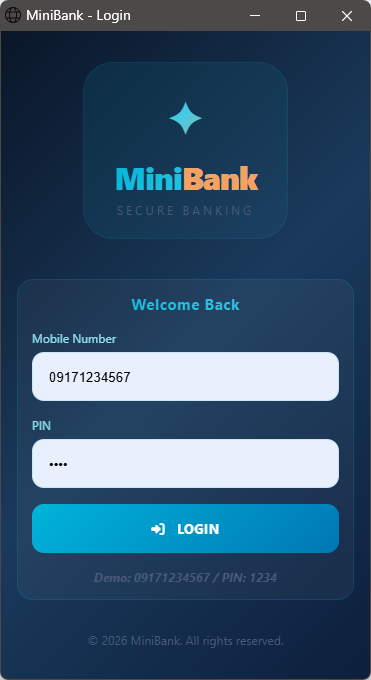
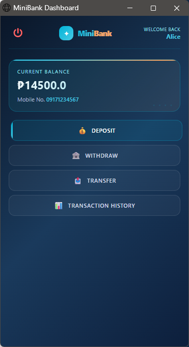
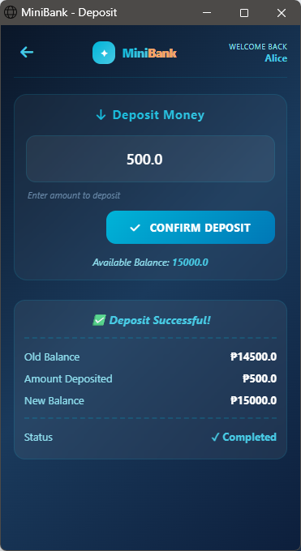
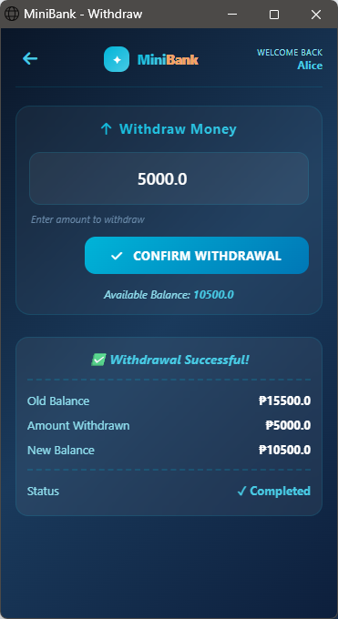
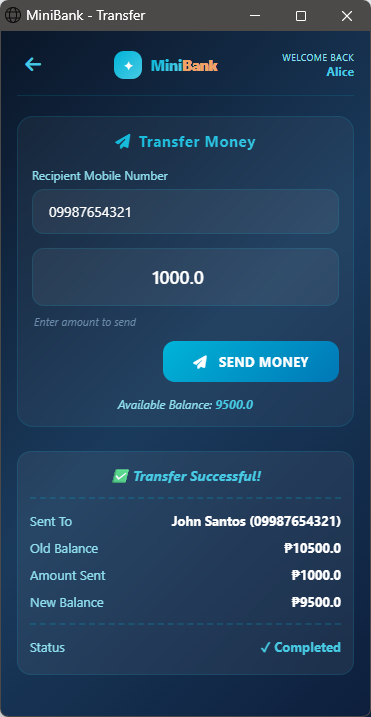
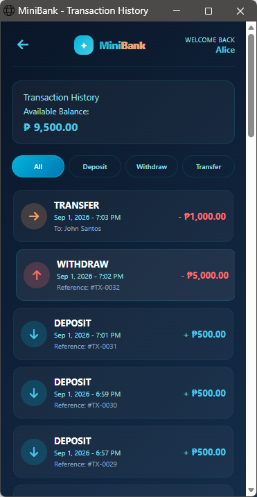

# MiniBank

A mobile banking simulation web app built with **Java Spring Boot** and **Thymeleaf**, modeled after e-wallet apps like GCash. Users can log in, check their balance, deposit, withdraw, transfer money to other users, and view a filterable transaction history.

**Repository:** https://github.com/eleypie/MiniBank

---

## Features

| Feature | Description |
|---|---|
| **User Authentication** | Login with mobile number and PIN, with account lockout after 3 failed attempts |
| **Check Balance** | View current balance on the dashboard |
| **Cash In (Deposit)** | Add money to your account |
| **Cash Out (Withdraw)** | Withdraw money, with insufficient-balance protection |
| **Cash Transfer** | Send money to another registered user by mobile number |
| **Transaction History** | View all transactions, filterable by type (All / Deposit / Withdraw / Transfer) |

## Tech Stack

- **Java 17**
- **Spring Boot 3.3.5** (Web, Thymeleaf)
- **Thymeleaf 3.1.2** — server-side templating
- **MySQL 8.x** — data persistence
- **JUnit 5 + Mockito** — unit testing
- **Maven** — build and dependency management
- **HTML5 / CSS3** — custom mobile-card UI

## Screenshots

| Login | Dashboard | Deposit |
|---|---|---|
|  |  |   |

| Withdraw | Transfer | Transaction History |
|---|---|---|
|  |  |  |

## Getting Started

### Prerequisites

- Java 17+
- Maven 3.9+
- MySQL 8.x running locally (or accessible remotely)

### Setup

1. **Clone the repository**
   ```bash
   git clone https://github.com/eleypie/MiniBank.git
   cd MiniBank
   ```

2. **Create the database** using the schema above (or an equivalent `.sql` file if included in `/resources`).

3. **Configure your database connection.**
   Update the connection details used by `DatabaseConnection.java` — ideally via environment variables or `src/main/resources/application.properties`, rather than hardcoding credentials:
   ```properties
   db.url=jdbc:mysql://localhost:3306/minibank
   db.username=root
   db.password=your_password
   ```

4. **Run the application**
   ```bash
   mvn spring-boot:run
   ```
   The app will start on `http://localhost:8080`.

5. **Log in** using a seeded user, or insert a test user directly:
   ```sql
   INSERT INTO user (first_name, last_name, mobile_number, pin) VALUES ('John', 'Doe', '09171234567', '1234');
   INSERT INTO account (user_id, balance) VALUES (1, 10000.00);
   ```

## Running Tests

```bash
mvn test
```

Run a specific test class:
```bash
mvn test -Dtest=DepositControllerTest
```

## Project Structure

```
src/
├── main/
│   ├── java/com/minibank/
│   │   ├── config/          # Database connection setup
│   │   ├── controller/      # Login, Dashboard, Deposit, Withdraw, Transfer, Transaction
│   │   ├── dao/              # AccountDao, TransactionDao, UserDao
│   │   ├── model/            # Account, Transaction, User
│   │   └── Main.java
│   └── resources/
│       ├── static/css/       # style.css
│       └── templates/        # Thymeleaf pages
└── test/java/com/minibank/
    ├── controller/            # Controller unit tests
    └── dao/                    # DAO unit tests
```

## Routes

| Method | Path | Description |
|---|---|---|
| GET | `/login` | Login page |
| POST | `/login` | Authenticate user |
| GET | `/dashboard` | Balance overview + menu |
| GET / POST | `/deposit` | Deposit form + processing |
| GET / POST | `/withdraw` | Withdraw form + processing |
| GET / POST | `/transfer` | Transfer form + processing |
| GET | `/transactions` | Transaction history (supports `?filter=ALL\|DEPOSIT\|WITHDRAW\|TRANSFER`) |

## License

_Add a license if this is meant to be reused by others (e.g. MIT)._

## Author

Loriel Ann — [github.com/eleypie](https://github.com/eleypie)
